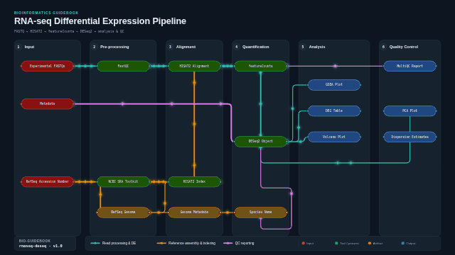

# ECU Bioinformatic Guidebook

The ECU bioinformatic guidebook is a comprehensive “how to” guide for common bioinformatic methodology targeted towards East Central University undergraduates looking to perform bioinformatic analysis. The reading is targeted towards biology undergraduates without a strong foundation in coding and computer science.

This repository contains a folder with the current edition of the ECU Undergraduate Bioinformatic Guidebook, along with any example scripts available in the edition. RNAseq is currently the only example pipeline available.

It is highly encouraged for future students to modify the guidebook to add new bioinformatic methodologies relevant to ECU, remove methodologies that have become irrelevant due to new technology, or add clarification where needed. It is recommended to make any edits on the original Google Document and to update the files in the GitHub Repository after completing any major revisions. Please contact your ECU research supervisor for access to the Google Document.


## Living Document

The material contained in this repository is intended as a living document for the East Central University bioinformatics community. Current and future students, researchers, and faculty are invited and encouraged to revise, extend, and update the content as methodologies evolve. All contributions remain under CC-BY-SA-4.0, ensuring the document stays open and revisable in perpetuity.


## RNAseq




---


### Quickstart Guide

1. Download and extract the latest release of "*RNAseqTemplate*" to an empty directory.

2. Create a fresh conda environment using the following command:

`conda create -n <environment_name> -c conda-forge -c bioconda python ncbi-datasets-cli hisat2 subread multiqc pandas fastqc rpy2 r-base r-tidyverse r-lazyeval r-ggplot2 r-pheatmap r-msigdbr bioconductor-deseq2 bioconductor-fgsea bioconductor-enhancedvolcano -y && conda activate <the_same_environment_name> -y` 

3. Download your experimental FASTQ files to the "files" directory. Ensure that forward and reverse reads end in "`_1`" and "`_2`" respectively. (You can rename if needed)

4. Edit the `metadata.csv` file in the "inputFiles" directory to reflect your experimental design (metadata file reflects the experimental design of the handbook's sample data).

5. Identify the "NCBI RefSeq assembly" for the model organism used in your experiment. (Note: Ensure that the **NCBI RefSeq** is used. The pipeline is currently incompatible with GenBank assemblies)

6. Navigate to the directory where the `rnaSeqDE.py` script is located and run the following command:

`python rnaSeqDE.py -f files -a <your_refseq_accession>`

Ensure you have sufficient storage on your computer to handle the experimental FASTQs and files created by the pipeline. After the pipeline completes, your analysis files can be found in the created "rnaseq_output" directory.

If there are any questions, please refer to the handbook located in the GuidebookReading folder of this git repository.


#### Important Quality Checks

Please note that not all results are good results. It is essential to check the quality of your RNAseq data before drawing any conclusions from the produced figures. Details on what to look for can be found in Chapter 3 of the handbook (found in the “GuidebookReading” directory) and I recommend fully reading that section for a detailed explanation on what to look for, what went wrong if anything, and how to fix it (if fixable).

However, in brief, I recommend checking these five aspects at a minimum. 

##### 1. **Bowtie2 PE Allignment Scores (Location: `rnaseq_output/qc/multiqc_report/multiqcreport.html`; Handbook Figure: 3.3)**

In this figure, you are looking for 2 specific things. First, you want to ensure that each of your samples has enough reads. This will be indicated by the total length of the bar. What “enough” is will depend on a number of factors, including model organism, sequencing technology, long vs. short reads, transcriptomic complexity, and many other factors. It is recommended to look into this data to be sure your data is reliable. However, the current ENCODE standards for RNAseq.

You are also looking for a high amount of uniquely mapped reads. A high amount of duplicate reads means that the reads are mapping to multiple locations on the genome with similar confidence. While duplicate mapping is expected to some extent, too few unique reads can result in poor statistical significance and less reliable results. The amount of reads that is considered adequate will vary greatly based on the model organism and the disease being studied.


##### 2. **FastQC: Per Sequence Quality Scores (Location: `rnaseq_output/qc/multiqc_report/multiqcreport.html`; Handbook Figure: 3.7)**

This figure gives you an idea of the overall quality of your reads. A low mean quality score (peaks in the red and yellow sections) indicates that we are less confident that our measured nucleotides are what we say they are. This could be for a variety of reasons described in Chapter 3 of the bioinformatic handbook.


##### 3. **FastQC: Per Sequence GC Content (Location: `rnaseq_output/qc/multiqc_report/multiqcreport.html`; Handbook Figure: 3.11)**

The graph should resemble a normal distribution with a single peak. A bimodal distribution (two peaks) is a strong indicator of sample contamination. The likely culprate is rRNA contamination; however, overrepresented samples (found at the bottom of the MultiQC report) can be put into [NCBI's BLAST](https://blast.ncbi.nlm.nih.gov/Blast.cgi) or the sample can be put through [Kraken2](https://github.com/DerrickWood/kraken2) to be sure.


##### 4. **PCA Plot (Location `rnaseq_output/rFigures/diagnostics/pcaGraph.png`; Handbook Figure: 3.15)**

Experimental groups should be spatially clustered and isolated from all other experimental groups. Inadequate clustering is an indication that the measured experimental variables are a poor representation of phenotypic variation.


##### 5. **Dispersion Estimates Plot (Location: `rnaseq_output/rFigures/diagnostics/dispersionEstimates.png`; Handbook Figure 3.19)**

The fitted trend line should drop below 1e-2. A high trendline is an indication that sample-to-sample variability is greater than expected, which could influence results or be a sign of contamination. However, the acceptable breakpoint for where the line should fall below varies based on the model organism you are looking at.

Secondly, you should see that gene estimate points and the final estimates should be spatially close together. Large discrepancies could indicate that you have too small a sample size or an outlier is present.


**Table 1: Current Encode RNAseq Standards**
| Resulting data status | Sequencing depth | Mapping rate | Replicate concordance (Spearman correlation) | Number of GENCODE genes detected |
|---|---|---|---|---|
| Good | ≥ 600,000 FLNC* reads/replicate | ≥ 90% mapped reads | ≥ 0.8 | ≥ 8,000 genes detected/replicate |
| Acceptable | 400,000–600,000 FLNC reads/replicate | 60–90% mapped reads | 0.6–0.8 | 4,000–8,000 genes detected/replicate** |
| Poor | < 400,000 FLNC reads/replicate | < 60% mapped reads | < 0.6 | < 4,000 genes detected/replicate** |

\* full-length nonchimeric reads

\*\* Exemptions may be made for samples where supporting short read RNA-seq data is available to validate the low gene count, given that short read samples are from the same cell type/cell line and pass all ENCODE standards


*Table 1: A table showing curent ENCODE standards for sequencing depth for mammalian long read RNAseq experiments adapted from the [ENCODE Project Website](https://www.encodeproject.org/rna-seq/long-read-rna-seq/). True acceptable sequencing depth will depend on a variety of factors related to experimental goals and design.*

---

### Hardware Requirements

Due to limited resources keeping me from testing on multiple devices, I am unsure on the minimum hardware specs required to run the pipeline. I have provided the hardware specs for the desktop computer that has reliably run this pipeline below:

#### Summary — Bioinformatics-Relevant Specs

Linux workstation well-suited for local RNA-seq pipelines (alignment, quantification, DE analysis with DESeq2/fgsea, etc.):

- **CPU:** AMD Ryzen 7 5800X — 8 cores / 16 threads (Zen 3+, boost to 4.85 GHz). Plenty of parallelism for STAR/HISAT2/salmon, `BiocParallel`-backed DESeq2, and multi-threaded QC tools.
- **RAM:** 128 GiB — generous headroom for STAR genome indices (human/mouse ~30 GB), large BAM sorts, in-memory `SummarizedExperiment` / `DESeqDataSet` objects, and concurrent R sessions.
- **GPU:** NVIDIA RTX 3060 (Ampere), driver 595.58.03, CUDA-capable — usable for GPU-accelerated bioinformatics (e.g., Parabricks, AlphaFold, deep-learning–based variant callers) and general ML workloads.
- **Storage:**
  - 931 GiB Samsung 980 NVMe SSD (`/`, 70% used) — fast scratch / working directory for FASTQ → BAM → counts pipelines.
  - 1.82 TiB SanDisk Extreme USB 3.2 SSD — useful for archiving raw reads, references, and intermediate outputs.
- **OS:** Linux Mint 22.3 (Ubuntu 24.04 "noble" base) — broad compatibility with Bioconductor, conda/mamba, Nextflow, Snakemake, and Docker (already installed).
- **R environment:** CRAN repositories (`cran.rstudio.com`, `cloud.r-project.org`) configured via apt, ready for Bioconductor installs.
- **Networking:** Wi-Fi 6E (MediaTek MT7922) active; Gigabit Ethernet available — adequate for pulling large reference genomes and uploading results.

**Caveats / notes:**
- Root partition is 70% full (645 GiB / 915 GiB used). Consider offloading large datasets to the external SanDisk SSD to avoid space pressure during heavy pipeline runs.
- Swap is only 2 GiB; with 128 GiB RAM it's rarely a concern, but worth bumping if running into OOM edge cases.
- External SSD is MBR-partitioned; reformatting to GPT + ext4 would be advisable if you plan to use it as a primary data drive.

##### Full System Specs


```
## System
- Kernel: 6.8.0-111-generic (x86_64, 64-bit)
- Compiler: gcc v13.3.0
- Clocksource: tsc
- Desktop: Cinnamon v6.6.7 (GTK 3.24.41, Muffin 6.6.3)
- Display Manager: LightDM v1.30.0
- Distro: Linux Mint 22.3 Zena (base: Ubuntu 24.04 noble)

## Machine
- Type: Desktop
- System: Micro-Star MS-7C95 v3.0
- Motherboard: Micro-Star PRO B550M-VC WIFI (MS-7C95) v3.0
- UEFI: American Megatrends LLC. v: H.C0 (07/15/2024)

## Battery
- Device-1: Pol Henarejos Pico Key — charge: N/A, status: discharging

## CPU
- Model: AMD Ryzen 7 5800X (8-core, MT MCP, SMT enabled)
- Architecture: Zen 3+ (rev 0)
- Cache: L1 512 KiB / L2 4 MiB / L3 32 MiB
- Speed: avg 3471 MHz (min 2200 / max 4851, boost enabled)
- Per-core (MHz): 3720, 3800, 4650, 3734, 3739, 2200, 4679, 2200,
                  2200, 3740, 2200, 4351, 3736, 3720, 4669, 2200
- Bogomips: 121603
- Flags: avx, avx2, ht, lm, nx, pae, sse, sse2, sse3, sse4_1,
        sse4_2, sse4a, ssse3, svm

## Graphics
- Device-1: NVIDIA GA106 [GeForce RTX 3060 Lite Hash Rate] (MSI)
  - Driver: nvidia v595.58.03 — Ampere — PCIe 16 GT/s x8
  - Active port: HDMI-A-1 (empty: DP-1, DP-2, DP-3)
- Display: X11 (X.Org v21.1.11, Xwayland v23.2.6, NVIDIA driver loaded)
- Screen: 1920x1080 @ 139 dpi (351x191 mm / 15.73")
- Monitor (HDMI-A-1): KYY 1920x1080 @ 143 dpi
- APIs:
  - EGL v1.5
  - OpenGL v4.6.0 (NVIDIA GeForce RTX 3060)
  - Vulkan v1.3.275 (9 layers)

## Audio
- Device-1: NVIDIA GA106 HD Audio (snd_hda_intel)
- Device-2: AMD Starship/Matisse HD Audio (snd_hda_intel)
- ALSA: k6.8.0-111-generic
- PipeWire: v1.0.5 (pipewire-pulse, wireplumber, pipewire-alsa active)

## Network
- Device-1: MediaTek MT7922 802.11ax (mt7921e) — wlo1 up
- Device-2: Realtek RTL8111/8168/8211/8411 Gigabit Ethernet (r8169) — enp42s0 down
- Other: docker0 down

## Bluetooth
- Device-1: MediaTek Wireless_Device (btusb v0.8, USB 2.1)
- Adapter: hci0 up — BT v5.2 / lmp v11

## Drives
- Total: 2.73 TiB (used: 1.82 TiB / 66.8%)
- ID-1: /dev/nvme0n1 Samsung SSD 980 1TB — 931.51 GiB — PCIe 31.6 Gb/s x4 — fw 4B4QFXO7 — 38.9 °C
- ID-2: /dev/sda SanDisk Extreme 55AE — 1.82 TiB — USB 3.2 @ 5 Gb/s — fw 3008

## Partitions
| Mount      | Size       | Used                | FS    | Device          |
|------------|------------|---------------------|-------|-----------------|
| /          | 915.32 GiB | 645.23 GiB (70.5%)  | ext4  | /dev/nvme0n1p2  |
| /boot/efi  | 511 MiB    | 6.1 MiB (1.2%)      | vfat  | /dev/nvme0n1p1  |

## Swap
- swap-1: file /swapfile — 2 GiB (0 KiB used, priority -2)

## USB
- Hub-1 (1-0:1): hi-speed hub, 10 ports, USB 2.0
  - 1-4: Yubico Yubikey 4/5 OTP+U2F+CCID
  - 1-5: Razer Naga Hex V2 (mouse/keyboard)
  - 1-7: Genesys Logic Hub (4 ports)
    - 1-8: Micro Star MYSTIC LIGHT (HID)
  - 1-9: MediaTek Wireless_Device (bluetooth)
- Hub-2 (2-0:1): super-speed hub, 4 ports, USB 3.1 @ 10 Gb/s
  - 2-3: SanDisk Extreme 55AE (mass storage)
- Hub-3 (3-0:1): hi-speed hub, 4 ports, USB 2.0
  - 3-1: Razer Firefly mouse mat
  - 3-4: CHERRY USB Keyboard
- Hub-4 (4-0:1): super-speed hub, 4 ports, USB 3.1 @ 10 Gb/s

## Sensors
- CPU: 56.0 °C
- Motherboard: 44.0 °C
- GPU (NVIDIA): 43 °C — fan 0%

## Repos
- Packages: 3789 (dpkg) + 31 (flatpak)

Additional repositories (/etc/apt/sources.list.d/):
- additional-repositories.list
  - deb http://cran.rstudio.com/bin/linux/ubuntu xia/
  - deb https://cloud.r-project.org/bin/linux/ubuntu zara-cran40/
- ascii-image-converter.list
  - deb [trusted=yes] https://apt.fury.io/ascii-image-converter/ /
- cubic-wizard-release-noble.list — PPA: cubic-wizard/release (noble main)
- kiwixteam-release-noble.list — PPA: kiwixteam/release (noble main)
- official-package-repositories.list
  - Linux Mint zena (main, upstream, import, backport)
  - Ubuntu noble (main, restricted, universe, multiverse)
  - Ubuntu noble-updates, noble-backports, noble-security
- slgobinath-gcalendar-noble.list — PPA: slgobinath/gcalendar (noble main)
- spotify.list — deb https://repository.spotify.com stable non-free
- steam-stable.list — deb [arch=amd64,i386] https://repo.steampowered.com/steam/ stable steam
- brave-browser-release.sources — Brave stable main
- vscode.sources — Microsoft VS Code stable main
- winehq-noble.sources — WineHQ noble main

## Info
- Memory: 128 GiB total (~125.72 GiB available, 9.37 GiB used / 7.5%)
- Processes: 469
- Uptime: 2h 46m
- Power states: freeze, mem, disk; suspend: deep; hibernate: platform
- Init: systemd v255 (target: graphical)
- Compilers: gcc 13.3.0
- Client: Unknown python3.12 client — inxi 3.3.34
```

## License
   - **Code** (scripts, pipelines, configs): GPL-3.0 — see [LICENSE](LICENSE)
   - **Written content** (guidebook text, documentation): CC-BY-SA-4.0 — see [LICENSE-docs](LICENSE-docs)
